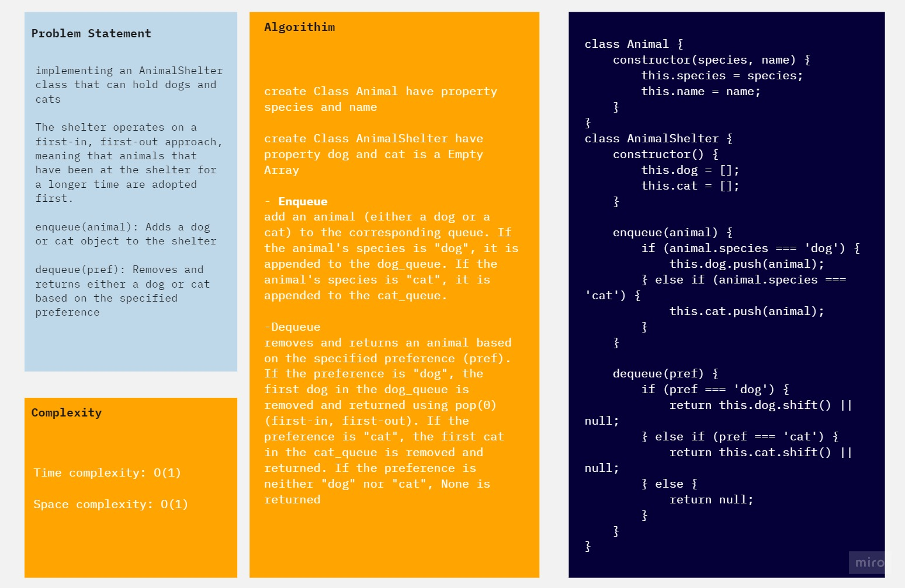

## Animal Shlter
implementing an AnimalShelter class that can hold dogs and cats

The shelter operates on a first-in, first-out approach, meaning that animals that have been at the shelter for a longer time are adopted first.

enqueue(animal): Adds a dog or cat object to the shelter

dequeue(pref): Removes and returns either a dog or cat based on the specified preference

## Whiteboard Process

## Solution
[Animla Shlter](./AnimalShlter.jpg)

