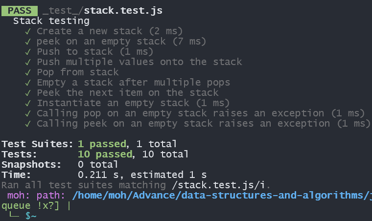

# Stacks and Queue
<!-- Description of the challenge -->
#### Stacks
Create a Stack class that has a top property. It creates an empty Stack when instantiated.
This object should be aware of a default empty value assigned to top when the stack is created.
#### Queue
Create a Queue class that has a front property. It creates an empty Queue when instantiated.
This object should be aware of a default empty value assigned to front when the queue is created.

## Whiteboard Process
<!-- Embedded whiteboard image -->
#### Stacks

#### Queue

## Approach & Efficiency
<!-- What approach did you take? Why? What is the Big O space/time for this approach? -->
Queue and Stacks is linear DataStructure 
have a time complixity O(1)
and Space time O(1)

## Solution
<!-- Show how to run your code, and examples of it in action -->
[Stacks](resource/Stack.js)
[Queue](resource/Queue.js)

## test  

#### Queue test

#### Stacks test

