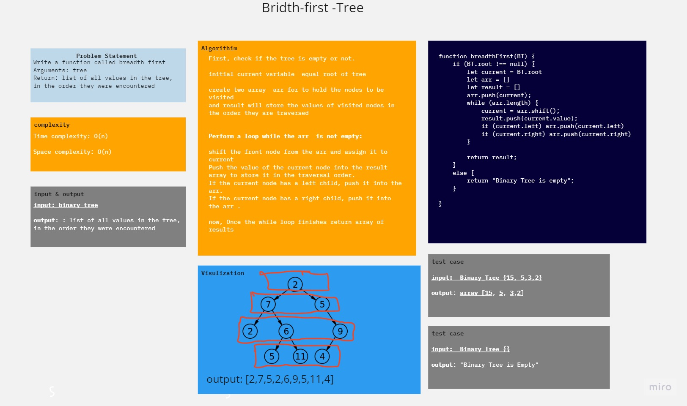
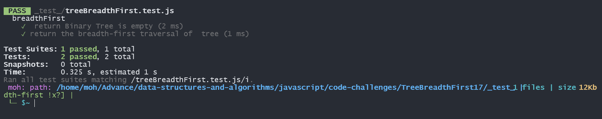

# Bridth first Search

Write a function called breadth first
Arguments: tree
Return: list of all values in the tree, in the order they were encountered

## Whiteboard Process

## Solution
[code](index.js)
[test](./_test_/treeBreadthFirst.test.js)
