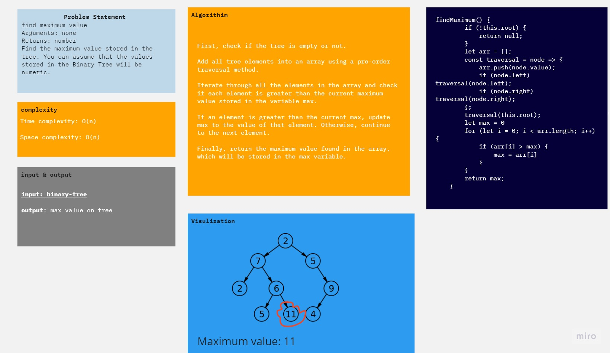
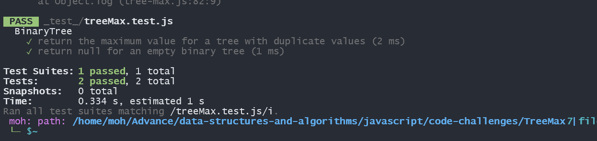

# Maximum Tree
find maximum value
Arguments: none
Returns: number
Find the maximum value stored in the tree. You can assume that the values stored in the Binary Tree will be numeric.

## Whiteboard Process

## Approach & Efficiency
time complixity = O(n)
Space complixity = O(n)

## Solution
[Code](tree-max.js)
[test]('./_test_/treeMax.test.js')

