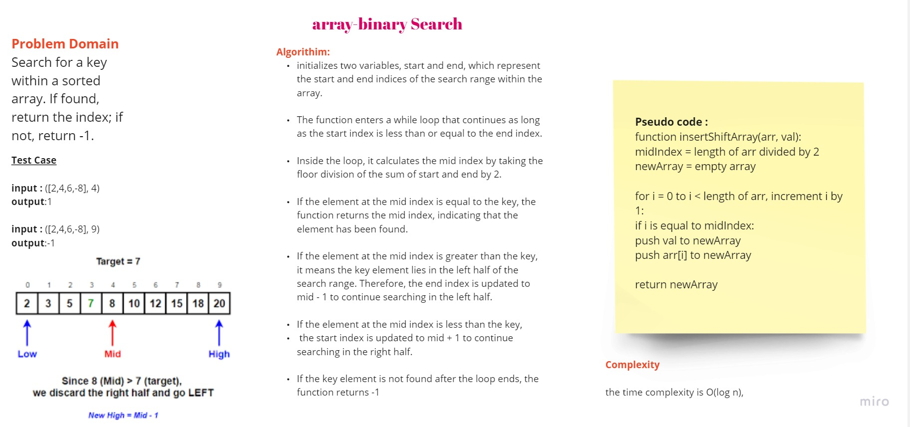

# Insert and Shift Array

## Challenge

function called 'BinarySearch' which takes in 2 parameters: a sorted array and the search key. Without utilizing any of the built-in methods available to your language, return the index of the array’s element that is equal to the value of the search key, or -1 if the element is not in the array.

## Whiteboard Process



## Approach and Efficiency

1- The approach used in this solution is as follows:
initializes two variables, start and end, which represent the start and end indices of the search range within the array.

2- The function enters a while loop that continues as long as the start index is less than or equal to the end index.

3- Inside the loop, it calculates the mid index by taking the floor division of the sum of start and end by 2.

4- If the element at the mid index is equal to the key, the function returns the mid index, indicating that the element has been found.

5- If the element at the mid index is greater than the key, it means the key element lies in the left half of the search range. Therefore, the end index is updated to mid - 1 to continue searching in the left half.

6- If the element at the mid index is less than the key,
the start index is updated to mid + 1 to continue searching in the right half.

7- If the key element is not found after the loop ends, the function returns -1

## Solution

```javascript
function binarySearch(arr, key) {
  let start = 0;
  let end = arr.length - 1;

  while (start <= end) {
    let mid = Math.floor((start + end) / 2);
    if (arr[mid] === key) {
      return mid;
    } else if (arr[mid] > key) {
      end = mid - 1;
    } else {
      start = mid + 1;
    }
  }
  // not found
  return -1;
}
```

### Example

```javascript
const arr = [4, 8, 15, 16, 23, 42];
const key = 15;

console.log(binarySearch(arr, key));
// Output: [2, 4, 5, 6, -8]
```
