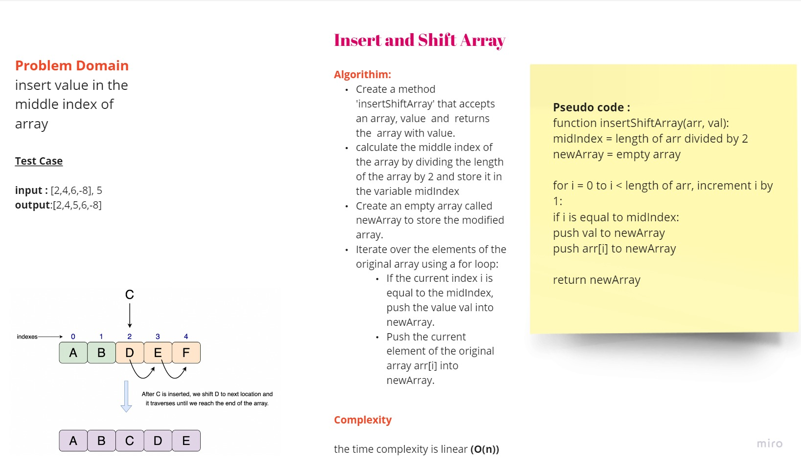

# Insert and Shift Array

## Challenge

Implement a function called `insertShiftArray` that takes in an array and a value to be added. The function should return a new array with the value inserted at the middle index of the original array. The function should not use any built-in methods provided by the programming language.

## Whiteboard Process




## Approach and Efficiency

The approach used in this solution is as follows:

1. Calculate the middle index of the array by dividing its length by 2.
2. Create a new array to store the modified values.
3. Iterate through the original array and insert the new value at the middle index by checking the current index.
4. Push the original values into the new array.
5. Return the modified array.

The time complexity of this approach is O(n) since it iterates through the original array once. The space complexity is O(n) as well, as the size of the new array is equal to the original array.

## Solution

```javascript
function insertShiftArray(arr, val) {
  let midIndex = Math.floor(arr.length / 2);
  let newArray = [];

  for (let i = 0; i < arr.length; i++) {
    if (i === midIndex) {
      newArray.push(val);
    }
    newArray.push(arr[i]);
  }

  return newArray;
}
```
### Example 

```javascript
const inputArray = [2, 4, 6, -8];
const value = 5;

console.log(insertShiftArray(inputArray, value));
// Output: [2, 4, 5, 6, -8]
