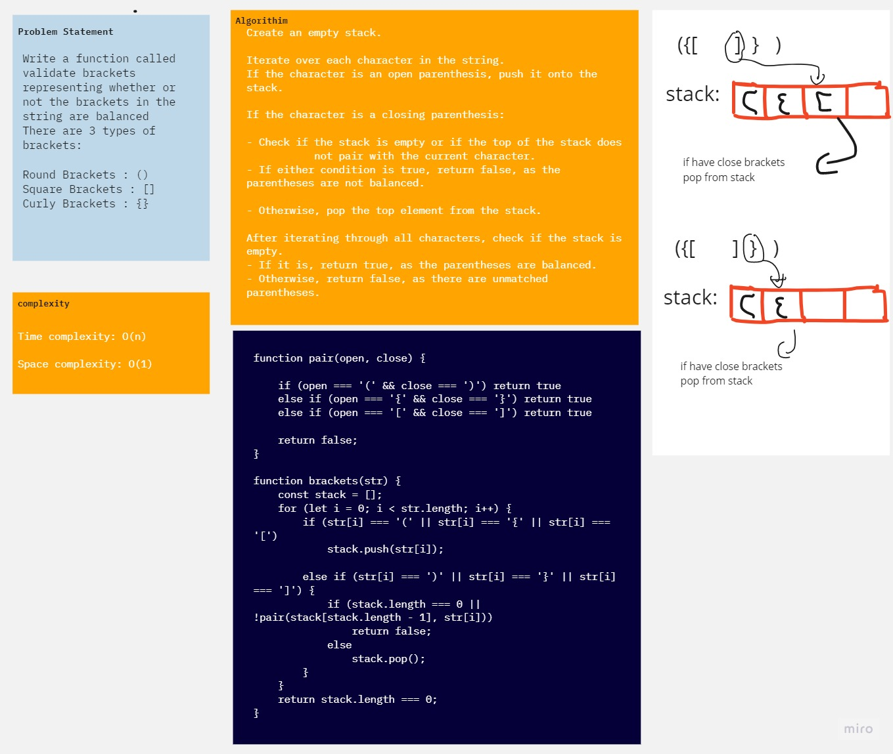

# Challenge Title
<!-- Description of the challenge -->

Write a function called validate brackets representing whether or not the brackets in the string are balanced
There are 3 types of brackets:

Round Brackets : ()
Square Brackets : []
Curly Brackets : {}

## Whiteboard Process
<!-- Embedded whiteboard image -->

## Solution
<!-- Show how to run your code, and examples of it in action -->
[code](index.js)
[test]('./_test_/brackets.test.js')