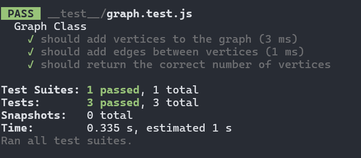

# Graph 

Challenge Type: *New Implementation*
Author : **Mohammad Attallah**

---

A graph is a non-linear data structure that can be looked at as a collection of vertices (or nodes) potentially connected by line segments named edges.

## Methode & Efficiency

#### `addVertex`

- **Arguments:** `value`
- **Returns:** The added vertex
- **Description:** Add a vertex to the graph.
- Time Complexity: O(1)
- Space Complexity: O(1)
#### `addEdge`

- **Arguments:** Two vertices to be connected by the edge, weight (optional)
- **Returns:** Nothing
- **Description:** Adds a new edge between two vertices in the graph. If specified, assign a weight to the edge. Both vertices should already be in the Graph.
- Time Complexity: O(1)
- Space Complexity: O(1)

#### `getVertices`

- **Arguments:** None
- **Returns:** All of the vertices in the graph as a collection (set, list, or similar)
- **Description:** Returns all vertices in the graph. An empty collection is returned if there are no vertices.
- Time Complexity: O(N)
- Space Complexity: O(N)

#### `getNeighbors`

- **Arguments:** `vertex`
- **Returns:** A collection of edges connected to the given vertex, including the weight of the connection
- **Description:** Returns a collection of edges connected to the specified vertex. An empty collection is returned if there are no vertices.
- Time Complexity: O(N)
- Space Complexity: O(1)

#### `size`

- **Arguments:** None
- **Returns:** The total number of vertices in the graph (0 if there are none)
- **Description:** Returns the total number of vertices in the graph.
- Time Complexity: O(1)
- Space Complexity: O(1)

#### Code & Unit test 

[Code](./index.js)
[Unit-test](./__test__/graph.test.js)

