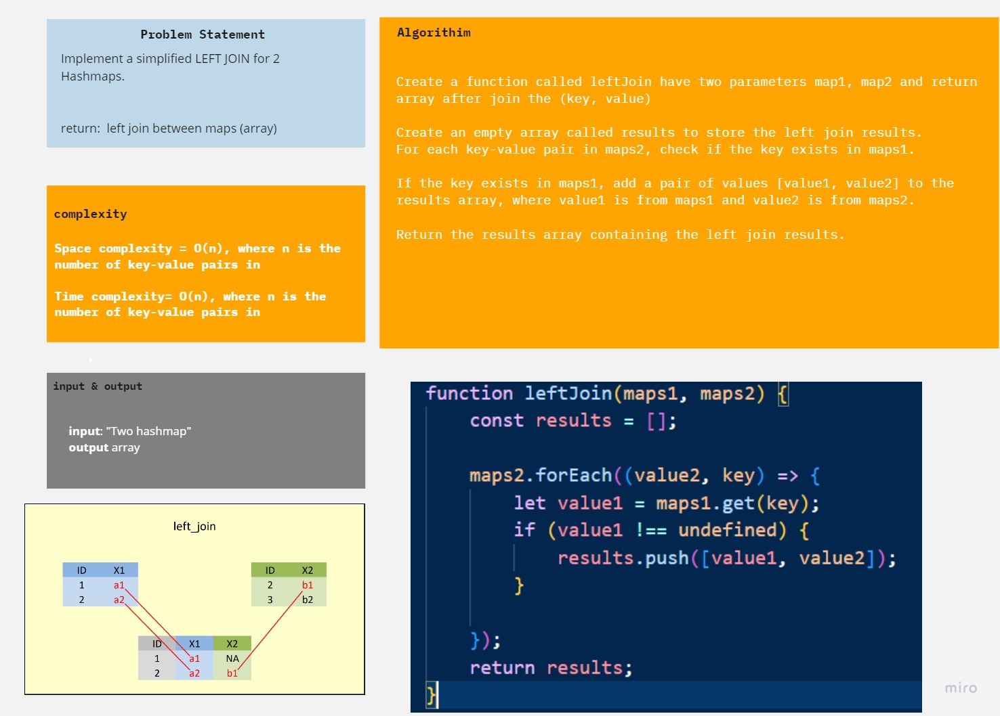

# left join
Write a function that LEFT JOINs two hashmaps into a single data structure.

### Description 
Write a function called left join
**Arguments**: *two hash maps*
The first parameter is a hashmap that has word strings as keys, and a synonym of the key as values.
The second parameter is a hashmap that has word strings as keys, and antonyms of the key as values.
**Return**: *array of results after join*

### whiteboard

### code & unit test
[code](./index.js)
[Unit test](./__test__/leftJoin.test.js)