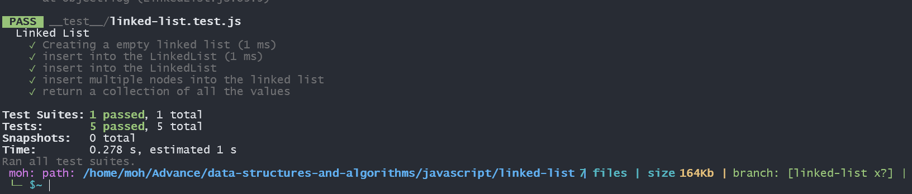

# Singly Linked Lists
<!-- Description of the challenge -->
implementation Singly Linked List
## Approach & Efficiency
<!-- What approach did you take? Why? What is the Big O space/time for this approach? -->
The provided code implements a linked list data structure using the `LinkedList` class and the `Node` class. Here's the analysis of the approach and efficiency for each method:

`insert(value)` method:

- This method adds a new node with the given value to the head of the linked list.
- It has a constant time complexity of O(1) because it only performs a few operations regardless of the size of the linked list.
- The steps involve creating a new node, updating the `next` property of the new node to point to the previous head, and then updating the `head` property to the new node.

`includes(value)` method:

- This method checks if a node with the given value exists in the linked list.
- It has a linear time complexity of O(n) in the worst case, where n is the number of nodes in the linked list.
- The method iterates through each node in the linked list, comparing the values until it finds a match or reaches the end of the list.

`toString()` method:

- This method returns a string representation of the linked list.
- It has a linear time complexity of O(n), where n is the number of nodes in the linked list.
- The method iterates through each node in the linked list, concatenating its value to the string representation.

Overall, the time complexity for the `insert(value)` method is O(1), while the `includes(value)` and `toString()` methods have a time complexity of O(n). The space complexity for all methods is O(1) since they do not use additional data structures that scale with the input size.


## Solution
<!-- Show how to run your code, and examples of it in action -->
#### Node Class
```Javascript

class Node {
  constructor(value) {
    this.value = value;
    this.next = null;
  }
}

module.exports = Node;
```
#### LinkedList Class
```Javascript 
class LinkedList {
  constructor() {
    this.head = null;
    this.size = 0;
  }
  //add a new node with that value to the head of the list with an O(1)

  insert(value) {
    let nextNode = this.head;

    const node = new Node(value);
    this.size++;

    // swap the head
    this.head = node;
    node.next = nextNode;
  }

  includes(value) {
    let currntNode = this.head;
    while (currntNode) {
      if (currntNode.value === value) {
        return true;
      }
      currntNode = currntNode.next;
    }
    return false;
  }

  toString() {
    let str = "";
    let currntNode = this.head;
    while (currntNode) {
      str = str.concat(`{${currntNode.value}} -> `);
      currntNode = currntNode.next;
    }
    str = str.concat(`${currntNode}`);
    return str;
  }
}
```
## test 
