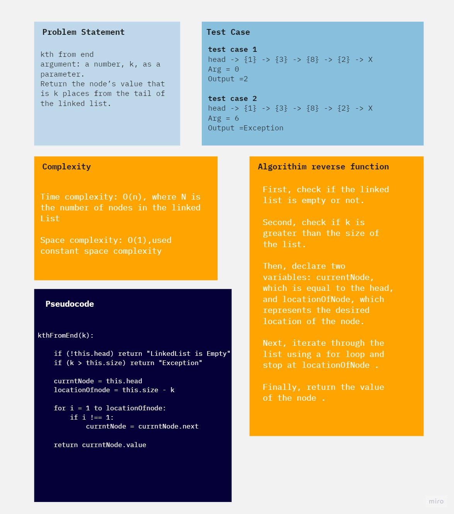

# linked-list-kth
<!-- Description of the challenge -->

## Whiteboard Process
<!-- Embedded whiteboard image -->



## Solution
<!-- Show how to run your code, and examples of it in action -->
```javascript
    kthFromEnd(k) {
        if (!this.head) return ("LinkedList is Empty");
        if (k > this.size) return ("Exception")
        let currntNode = this.head
        let locationOfnode = this.size - k;

        for (let i = 1; i <= locationOfnode; i++) {
            if (i !== 1) currntNode = currntNode.next;
        }
        return currntNode.value;
  }

```