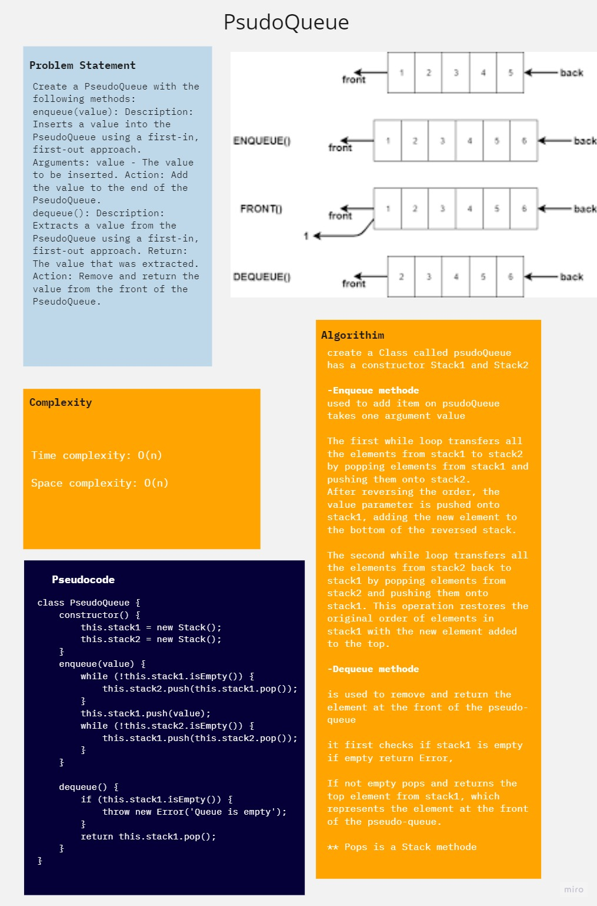

## psudoQueue

Create a PseudoQueue with the following methods:
enqueue(value): Description: Inserts a value into the PseudoQueue using a first-in, first-out approach. Arguments: value - The value to be inserted. Action: Add the value to the end of the PseudoQueue.
dequeue(): Description: Extracts a value from the PseudoQueue using a first-in, first-out approach. Return: The value that was extracted. Action: Remove and return the value from the front of the PseudoQueue.

## Whiteboard Process

## Solution
[pseudo Queue](./pseudoQueue.js)