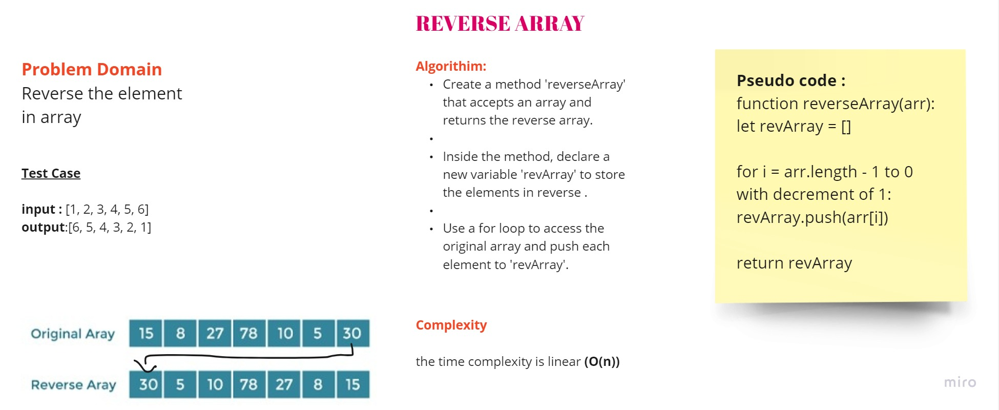

# Reverse Array

## Whiteboard Process



## Approach & Efficiency

The code uses a simple approach to reverse an array:

1. Initialize an empty array called `revArray`.
2. Iterate over the elements of the input array (`arr`) in reverse order using a `for` loop.
3. Push each element to the `revArray` using the `push()` method.
4. Return the `revArray`, which contains the reversed elements.

The time complexity of this code is O(n), where n is the number of elements in the input array. This is because the code iterates through the array once. The space complexity is also O(n) since the reversed array has the same length as the input array.

## Solution

```javascript
function reverseArray(arr) {
  let revArray = [];

  for (let i = arr.length - 1; i >= 0; i--) {
    revArray.push(arr[i]);
  }
  return revArray;
}

console.log(
  reverseArray([
    2, 3, 5, 7, 11, 13, 17, 19, 23, 29, 31, 37, 41, 43, 47, 53, 59, 61, 67, 71,
    73, 79, 83, 89, 97, 101, 103, 107, 109, 113, 127, 131, 137, 139, 149, 151,
    157, 163, 167, 173, 179, 181, 191, 193, 197, 199,
  ])
);
```
