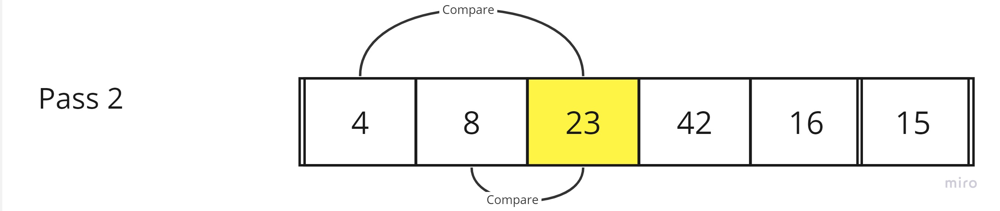
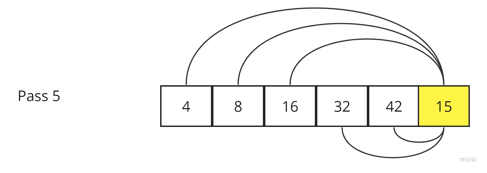
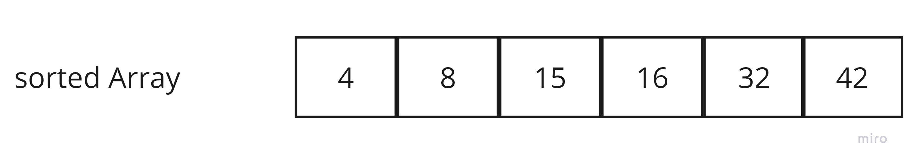

## Insertion Sort 

---

Insertion sort is a simple sorting algorithm that works similar to the way you sort playing cards in your hands. The array is virtually split into a sorted and an unsorted part. Values from the unsorted part are picked and placed at the correct position in the sorted part.


### Pseudocode

```js

Insert(int[] sorted, int value)
  initialize i to 0
  WHILE value > sorted[i]
    set i to i + 1
  WHILE i < sorted.length
    set temp to sorted[i]
    set sorted[i] to value
    set value to temp
    set i to i + 1
  append value to sorted

InsertionSort(int[] input)
  LET sorted = New Empty Array
  sorted[0] = input[0]
  FOR i from 1 up to input.length
    Insert(sorted, input[i])
  return sorted

```

### Trace
**Sample Arrays :** [8,4,23,42,16,15]


- **Pass 1**:
  
  - Current element: 4
  - Compare with elements to the left [8 > 4]
  - *Swap: [4, 8, 23, 42, 16, 15]*

- **Pass 2**:
   
  - Current element: 23
  - Compare with elements to the left  (8, 4): [8 < 23], [4 < 23]
  - as it is [4, 8, 23, 42, 16, 15]

- **Pass 3**: 
   
  - Current element: 42
  - Compare with elements to the left  (23, 8, 4): [23 < 42], [8 < 42], [4 < 42]
  - as it is [4, 8, 23, 42, 16, 15]
 
- **Pass 4**: 
   
  - Current element: 16
  - Compare with elements to the left (42, 23, 8, 4): [42 > 16], [23 > 16], [8 < 16], [4 < 16]
  - *insert After 8 [4, 8, 16, 23, 42, 15]*

- **Pass 5**: 
   
  - Current element: 15
  - Compare with elements to the left (42, 23, 16, 8, 4): [42 > 15], [23 > 15], [16 > 15], [8 > 15], [4 < 15]
  - *insert After 8 [4, 8, 15, 16, 23, 42]*

 
**The sorted list is now: [4, 8, 15, 16, 23, 42]**


### Efficency

*Space Complexity*: **O(1)**, It uses a fixed, constant amount of memory for temporary variables, regardless of how many elements are being sorted.

*Time Complexity*:**O(n^2)**, n represents the number of elements in the input array or list that you are sorting


### JS Code
[Code](./index.js)