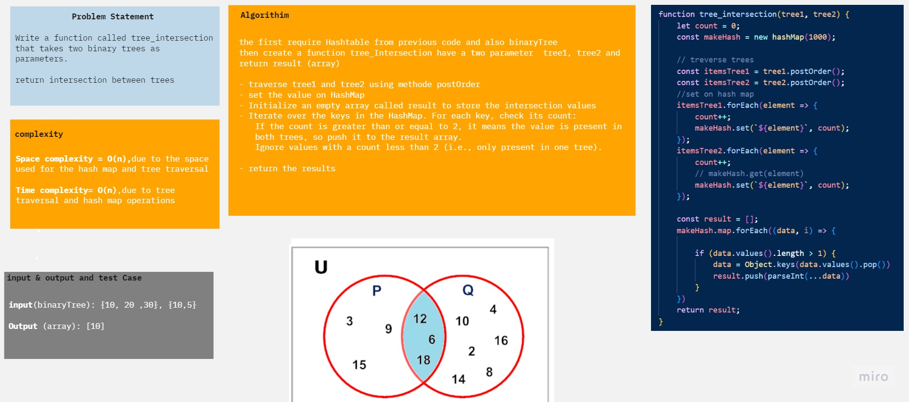

# tree-intersection

### Description 
Find common values in 2 binary trees.

Write a function called tree_intersection that takes two binary trees as parameters.
Using your Hashmap implementation as a part of your algorithm, return a set of values found in both trees.

### whiteboard 

### Code & unit test 
[Code](./tree-intersection.js)
[UnitTest](./_test_/tree-intersection.test.js)