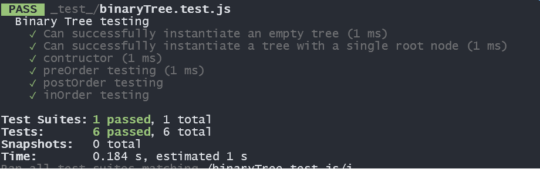
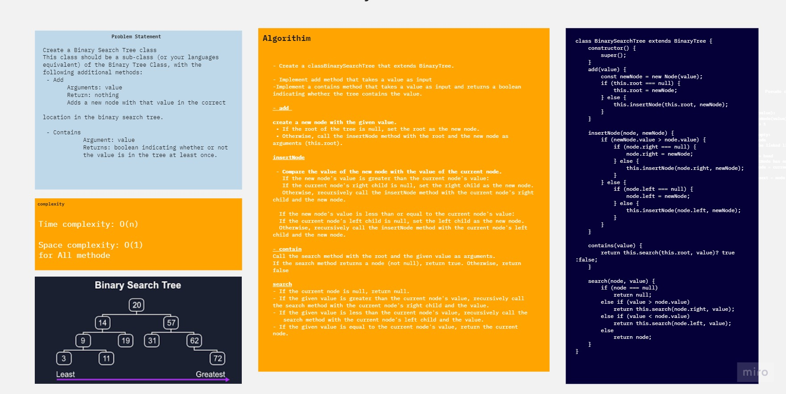
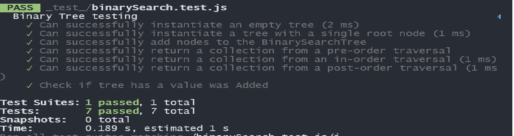

# Challenge Title
<!-- Description of the challenge -->

### Node
- Create a Node class that has properties for the value stored in the node, the left child node, and the right child node.

### Binary Tree
- Create a Binary Tree class
    - Define a method for each of the depth first traversals:
        - pre order
        - in order
        - post order
    - Each depth first traversal method should return an array of values, ordered appropriately.

###  Binary Search Tree
- Create a Binary Search Tree class
    - This class should be a sub-class (or your languages equivalent) of the Binary Tree Class, with the following additional methods:
- Add
    - Arguments: value
    -Return: nothing
    -Adds a new node with that value in the correct location in the binary search tree.
- Contains
    - Argument: value
    - Returns: boolean indicating whether or not the value is in the tree at least once.

## Whiteboard Process
<!-- Embedded whiteboard image -->
#### Binary Tree

#### Binary Search Tree

## Solution
<!-- Show how to run your code, and examples of it in action -->
[BinaryTree]('./lib/BinaryTree.js')
[BinarySearchTree](''./lib/BinarySearchTree.js)
[test](_test_)